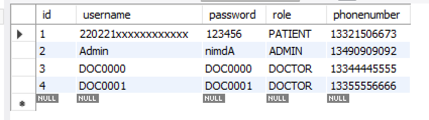
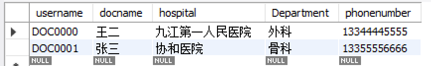
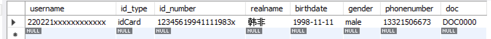
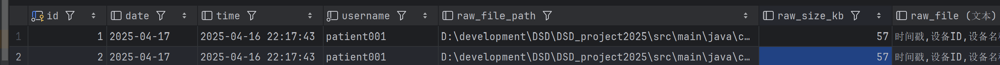

# System 组与 Data 组协作 API 文档

## 1. 项目概述

本项目是一个医患管理系统，包含用户认证、医生患者关系管理、报告生成与分析等功能。System 组负责实现业务逻辑和 API 接口( service & controller)，Data 组负责数据持久化和访问层实现（entity & repository）。本文档旨在明确 System 组对 Data 组的接口需求，以便双方高效协作。

## 2. 系统架构

项目采用分层架构：

- **Controller 层**：处理 HTTP 请求，参数验证，响应封装（System 组负责）
- **Service 层**：实现业务逻辑，权限验证，事务管理（System 组负责）
- **Repository 层**：定义数据访问方法（System 组定义，Data 组实现）
- **Entity 层**：具体数据库操作实现（Data 组负责）


## 3.数据清洗

### DataManager

单例懒加载的数据清洗类，调用python脚本进行时间对齐。由data team组内的RecordService调用。

```java
public class DataManager {
    private final Integer frequency;
    private final String pythonEdition;
    private final String pythonFilePath;

    // 私有构造函数，防止外部直接 new
    private DataManager() {
        // 可以在此初始化 frequency
        frequency = 2;
        pythonEdition = "python";
//        pythonFilePath = "clean_script.py";
        pythonFilePath = "D:\\development\\DSD\\DSD_project2025\\src\\main\\java\\com\\example\\factorial\\src\\dataProcess\\clean_script.py";
    }

    private static volatile DataManager instance;    // 使用 volatile 确保多线程下的可见性与禁止指令重排序

    public static DataManager getInstance();

    //对指定路径的csv原始数据文件清洗并存到新文件里，返回新文件路径
    public String rawToCleaned(String  rawPath) throws IOException, InterruptedException;
```


## 4. 实体类设计建议

### 4.1 User




#### User entity

```java
public class User {
    @Id
    @GeneratedValue(strategy = GenerationType.IDENTITY)
    private Long id;

    @Column(name = "username", nullable = false, unique = true)
    private String username;
    
    @Column(name = "password", nullable = false)
    private String password;

    /** 联系电话（允许国际区号，可根据需要调整正则） */
    @Column(name = "phonenumber", length = 45)
    @Pattern(regexp = "^\\+?\\d{1,45}$", message = "电话号码格式不正确")
    private String phonenumber;

    /** 角色类型（DOCTOR/PATIENT） */
    @Enumerated(EnumType.STRING)
    @Column(name = "role", columnDefinition = "ENUM('DOCTOR','PATIENT','ADMIN')")
    private User.RoleType roletype;
    
    /* ---------- 枚举 ---------- */
    public enum RoleType {
        @JsonProperty("DOCTOR")
        DOCTOR,
        @JsonProperty("PATIENT")
        PATIENT,
        @JsonProperty("ADMIN")
        ADMIN,
    }
    
    // 构造函数、getter和setter方法
}
```

对于每个字段，都有getter和setter方法。

#### UserRepository

用于用户信息的增删改查和认证。

```java
public interface UserRepository {
    //C
    User(String username, String password, User.RoleType roletype, String phonenumber)
	//R
    User findById(Long id);
    List<User> findAll();
    User findByUsername(String username);  // 根据用户名精确查询
    User findByPhoneNumber(String phone);        // 根据手机号精确查询
    User findByUsernameOrPhoneNumber(String usernameOrPhone); // 同时查询用户名和手机号字段
    List<User> findByUserType(String userType);  // 例如：ADMIN, DOCTOR, PATIENT
    //**boolean existsByUsername(String username); //不需要，使用findByUsername()替代
    //**boolean existsByPhone(String phone);	//不需要，findByPhone()替代

    //U
    User save(User user);
    //D
    void deleteById(Long id);
    void deleteByUsername(Long id);
}
```

##### 接口用法示例

##### //Create

User(String username, String password, User.RoleType roletype)

创建新User

##### //Read

User findByUsername(String username);

根据用户名精确查询，若找不到则返回NULL

```java
        try {
            User notExistUser = userRepository.findByUsername("notExistUser");
            System.out.println("findByUsername():" + notExistUser.toString());
        }catch (RuntimeException e) {
            System.out.println("Error: " + e.getMessage());
        }
//: Cannot invoke "com.example.factorial.src.entity.User.toString()" because "notExistUser" is null

```

List<User> findByRole(String userType); 

查找user表里的所有{Role}，例如ADMIN, DOCTOR, PATIENT

boolean existsByUsername(String username);

直接使用findByUsername()即可。

java. util. Optional<T> findById(Long id);

查询根据主键（id），若找不到则返回异常

```java
        // findById 异常
        Long notExistId = 999L;
        try {
            User notExistUser = userRepository.findById(notExistId)
                    .orElseThrow(() -> new RuntimeException("User with id "+notExistId+ "not found"));
            System.out.println("findById(): " + admin.toString());
        } catch (RuntimeException e) {
            System.out.println("Error: " + e.getMessage());
        }
//Error: User with id 999not found
```

List<User> findAll();

查询所有用户，若找不到则返回NULL

```java
        //findAll
        // 查询所有用户
        System.out.println("findByAll(): ");
        List<User> all = userRepository.findAll();
        all.forEach(System.out::println);
```

##### //Update

**User save(User user);**

保存user

**void setPassword/Roletype/username(String/User.RoleType/String)**

修改User信息（但是没有存到数据库，需要使用save() 才能存到数据库中）

##### //Delete

**void deleteById(Long id);**

根据主键（id）删除用户

**void deleteByUsername(String username);**

根据username删除用户

```java
        // 删除用户
        if (userRepository.findByUsername(updatedUser.getUsername()) != null) {
            userRepository.deleteByUsername(updatedUser.getUsername());//根据username删除
//              userRepository.deleteById(updatedUser.getId()); //根据id删除
            System.out.println("deleteByUsername: " + updatedUser.getUsername());
        }else{
            System.out.println(updatedUser.getUsername() + "not found");
        }
```


### 4.2 Doctor



#### Doctor entity

```java
public class Doctor {

    /** 主键：登录用户名 */
    @Id
    @Column(name = "username", nullable = false, length = 255)
    @NotBlank(message = "用户名不能为空")
    @Size(max = 255, message = "用户名长度不能超过 255 字符")
    private String username;

    /** 医生姓名 */
    @Column(name = "docname", length = 45)
    @Size(max = 45, message = "医生姓名长度不能超过 45 字符")
    private String docname;

    /** 所属医院 */
    @Column(name = "hospital", length = 45)
    @Size(max = 45, message = "医院名称长度不能超过 45 字符")
    private String hospital;

    /** 科室 */
    @Column(name = "Department", length = 45)
    @Size(max = 45, message = "科室名称长度不能超过 45 字符")
    private String department;

    /** 联系电话（允许国际区号，可根据需要调整正则） */
    @Column(name = "phonenumber", length = 45)
    @Pattern(regexp = "^\\+?\\d{1,45}$", message = "电话号码格式不正确")
    private String phonenumber;

    /** 业务构造器（可按需扩展） */
    public Doctor(String username,
                  String docname,
                  String hospital,
                  String department,
                  String phonenumber) {
        this.username   = username;
        this.docname    = docname;
        this.hospital   = hospital;
        this.department = department;
        this.phonenumber= phonenumber;
    }
}
```
构造示例：

```
Doctor doctor = new Doctor(
        "dr001",
        "张三",
        "协和医院",
        "神经内科",
        "+8613800000000"
);
```

#### DoctorRepository

用于医生信息管理。

```java
public interface DoctorRepository {
    Optional<T> findById(String id);//根据主键（这里的主键是username，如"DOC001")查询医生
    Doctor findByUsername(String id);//根据username(如;"DOC001")查询医生
    Doctor findByDocname(String name);//根据姓名（如“张三”）查询医生
    Doctor findByPhonenumber(String phone);
    
    //Doctor findByName(String name);//实现为findByDocname()和findByUsername(),如上
    List<Doctor> findAll();
	List<Doctor> findByDocnameOrPhonenumber(@Size(max = 45, message = "医生姓名长度不能超过 45 字符") String docname, @Pattern(regexp = "^\\+?\\d{1,45}$", message = "电话号码格式不正确") String phonenumber);
    List<Doctor> findByHospital(String hospital);
    List<Doctor> findByDepartment(@Size(max = 45, message = "科室名称长度不能超过 45 字符") String department);

    Doctor save(Doctor doctor);
    
    void deleteById(String id);//根据主键（username，如"DOC001")删除医生
	void deleteByUsername(@NotBlank(message = "用户名不能为空") @Size(max = 255, message = "用户名长度不能超过 255 字符") String username);
}
```


### 4.3 Patient



#### Patient entity

```java
public class Patient {

    /** 用户名 —— 主键 */
    @Id
    @Column(name = "username", length = 255, nullable = false)
    @Size(max = 255, message = "用户名长度不能超过 255 字符")
    private String username;

    /** 证件类型（passport / idCard） */
    @Enumerated(EnumType.STRING)
    @Column(name = "id_type", columnDefinition = "ENUM('passport','idCard')")
    private IdType idtype;

    /** 证件号码 */
    @Column(name = "id_number", length = 32)
    @Size(max = 32, message = "真实姓名长度不能超过 32 字符")
    private String idnumber;


    /** 真实姓名 */
    @Column(name = "realname", length = 45)
    @Size(max = 45, message = "真实姓名长度不能超过 45 字符")
    private String realname;

//    /** 出生年份（建议 YYYY） */
//    @Column(name = "birthdate", length = 4)
//    @Pattern(regexp = "^(19|20)\\d{2}$",
//             message = "出生年份必须是 1900–2099 之间的 4 位数字")
//    private String birthyear;
    /** 出生日期（格式 YYYY-MM-DD） */
    @Column(name = "birthdate")
    @Pattern(
            regexp = "^\\d{4}-(0[1-9]|1[0-2])-(0[1-9]|[12]\\d|3[01])$",
            message = "出生日期必须是格式为 YYYY-MM-DD 的合法日期"
    )
    private String birthdate;


    /** 性别（male / female） */
    @Enumerated(EnumType.STRING)
    @Column(name = "gender", columnDefinition = "ENUM('male','female')")
    private Gender gender;

    /** 联系电话（允许 +86-12345678901 或 11 位手机号） */
    @Column(name = "phonenumber", length = 45)
//    @Pattern(
//        regexp = "^(\\+?\\d{1,4}[- ]?)?\\d{5,20}$",
//        message = "电话号码格式不正确"
//    )
    private String phonenumber;

    /** 对应就诊医生（可为空，45 字符以内） */
    @Column(name = "doc", length = 45)
    @Size(max = 45, message = "医生字段长度不能超过 45 字符")
    private String doc;

    /* ---------- 枚举 ---------- */

    public enum IdType {
        @JsonProperty("passport")
        passport,
        @JsonProperty("idCard")
        idCard
    }

    public enum Gender {
        male, female
    }

    /* ---------- 业务构造器 ---------- */
    public Patient(String username,
                   IdType idtype,
                   String realname,
                   String birthdate,
                   Gender gender,
                   String phonenumber,
                   String doc) {
        this.username    = username;
        this.idtype      = idtype;
        this.realname    = realname;
        this.birthdate   = birthdate;
        this.gender      = gender;
        this.phonenumber = phonenumber;
        this.doc         = doc;
    }

    public Patient(String username,
                   IdType idtype,
                   String realname,
                   String birthdate,
                   Gender gender,
                   String phonenumber) {
        this.username    = username;
        this.idtype      = idtype;
        this.realname    = realname;
        this.birthdate   = birthdate;
        this.gender      = gender;
        this.phonenumber = phonenumber;
    }
    
    // 构造函数、getter和setter方法
}
```

构造示例

```
Patient patient = new Patient(
        "test_user_002",
        Patient.IdType.idCard,
        "李三",
        "2000-11-22",
        Patient.Gender.male,
        "+8613712345678"
);
```

#### PatientRepository

用于患者信息管理。

```java
public interface PatientRepository {
    //R
    Patient findById(String id);//根据主键（这里的主键是username，如"pat001")查询患者
    Patient findByUsername(String username);
    Patient findByIdNumber(String idNumber); // 根据身份证号/护照号查询
    Patient findByPhonenumber(String phonenumber)
//    Patient findByName(String name);//实现为findByUsername()，如上
//    Patient findByPhone(String phone);//实现为findByPhonenumber()，如上
    List<Patient> findAll();
    List<Patient> findByIdType(Patient.IdType idType);//根据护照/身份证查找
    List<Patient> findByRealname(@Size(max = 45, message = "真实姓名长度不能超过 45 字符") String realname);//根据真实姓名（如"韩非"）查找
    List<Patient> findByRealnameContaining(String realname);//根据真实姓名（如"三"）模糊查找
    List<Patient> findByGender(Patient.Gender gender);//根据性别查找
    List<Patient> findByBirthdate(String year);//根据出生年份查找
    List<Patient> findByDoc(String doc);    /** 根据就诊医生查询患者列表 */

    //U
    Patient save(Patient patient);
    
    //D
    void deleteById(String id);
//    boolean existsByIdNumber(String idNumber);//实现为findByIdNumber()
}
```

### 4.4 Record




#### record entity

```java
public class Record {

    @Id
    @GeneratedValue(strategy = GenerationType.IDENTITY)
    private Long id;

    @Temporal(TemporalType.DATE)
    @Column(name = "date")
    private Date date;//YYYY-MM-DD (2025-04-17)

    @Temporal(TemporalType.TIMESTAMP)
    @Column(name = "time")
    private Date time;//YYYY-MM-DD hh:mm:ss (2025-04-16 22:17:43)

    @Column(name = "username", length = 50, nullable = false)
    private String username;

    @Column(name = "raw_file_path")
    private String rawFilePath;

    @Column(name = "raw_size_kb")
    private Integer rawSizeKb;//文件大小，以kb为单位

    @Lob
    @Column(name = "raw_file", columnDefinition = "LONGBLOB")
    private byte[] rawFile;//原始数据文件的内容

    // 其他字段保留但可为 null，无需初始化
    @Column(name = "format_file_path")
    private String formatFilePath;//时间对齐的数据文件的内容

    @Column(name = "format_size")
    private Integer formatSize;//文件大小，以kb为单位

    @Lob
    @Column(name = "format_file", columnDefinition = "LONGBLOB")
    private byte[] formatFile;

    @Column(name = "report_file_path")
    private String reportFilePath;

    @Column(name = "report_size")
    private Integer reportSize;//文件大小，以kb为单位

    @Lob
    @Column(name = "report_file", columnDefinition = "LONGBLOB")
    private byte[] reportFile;//报告文件的内容

    // Getter / Setter / 构造函数等略，可用 Lombok 简化

    public Record(Date date, Date time, String username,
                  String rawFilePath, Integer rawSizeKb, byte[] rawFile) {
        this.date = date;
        this.time = time;
        this.username = username;
        this.rawSizeKb = rawSizeKb;
        this.rawFile = rawFile;
        this.formatSize = 0;
        this.formatFile = new byte[0];
        this.reportSize = 0;
        this.reportFile = new byte[0];
    }
}
```

#### RecordRepository

用于数据文件的保存和处理。

```java
public interface RecordRepository {
    Record save(Record record);
    Optional<Record> findById(Long id);//
    List<Record> findAll();
    void deleteById(Long id);
    
// 根据用户名和精确时间查找
	List<Record> findByUsernameAndTime(String username, Date time);

// 根据用户名和日期查找
	List<Record> findByUsernameAndDate(String username, Date date);

// 查找某个用户的所有记录
	List<Record> findByUsername(String username);

// 查找某一天的所有记录
	List<Record> findByDate(Date date);
   
}
```

#### RecordService

```java
        List<Record> records = recordService.insertTwoCsvRecords(String username, String csvPath1, String csvPath2);//根据用户名，存入新采集到的两个csv文件，并进行数据清洗（时间对齐）
        List<Record> records = recordService.insertFourCsvRecords(String username, String csvPath1, String csvPath2, String csvPath3, String csvPath4);//根据用户名，存入新采集到的4个csv文件，并进行数据清洗（时间对齐）

```


